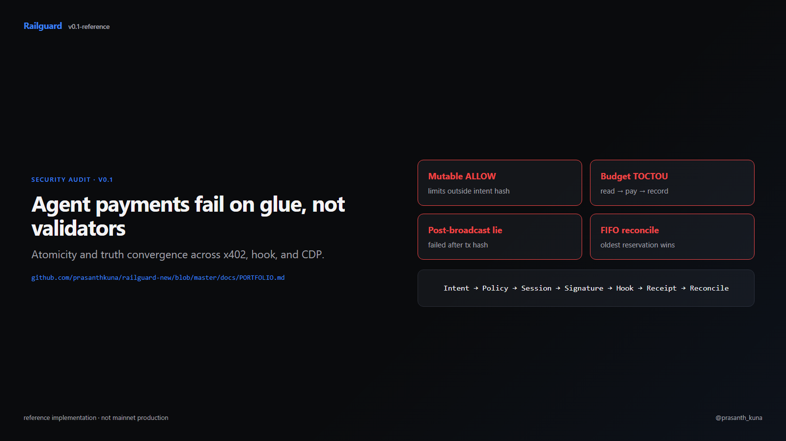
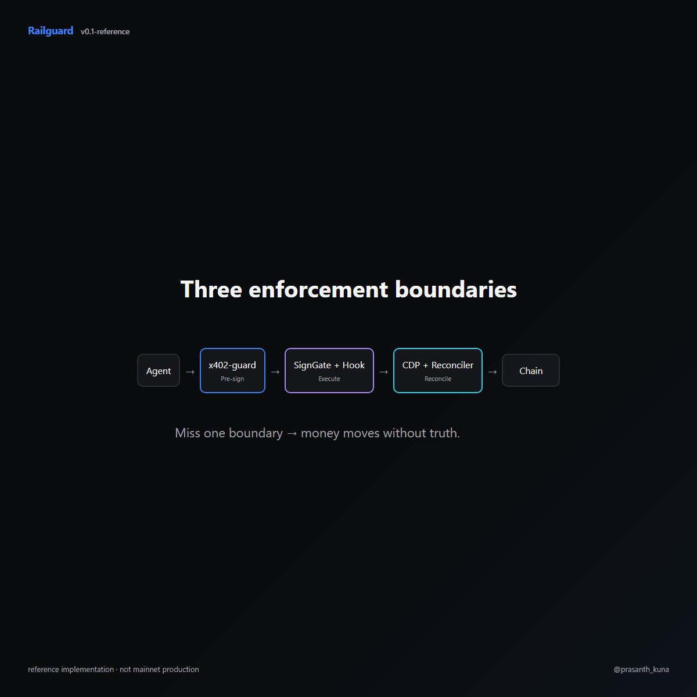

# Railguard

[](https://github.com/prasanthkuna/railguard-new/actions/workflows/ci.yml)
[](https://github.com/prasanthkuna/railguard-new/releases/tag/v0.1-reference)
[](./LICENSE)
[](./scripts/e2e-happy-path.ps1)
[](./docs/RELEASE_v0.1-reference.md)

Policy-enforced execution safety layer for AI-agent stablecoin payments.

> **Only link to send:** [docs/PORTFOLIO.md](./docs/PORTFOLIO.md) — reviewer path, demos, failure modes, honest gaps.





> **Reviewer quick path (≈10 min):** `make test` → [docs/FAILURE_MODES_FIXED.md](./docs/FAILURE_MODES_FIXED.md) → `scripts/e2e-happy-path.ps1`

## Three-repo stack

| Repo | Role |
|------|------|
| **[railguard-new](https://github.com/prasanthkuna/railguard-new)** (this repo) | SignGate, Solidity hook/adapter, SDK, watcher |
| **[x402-guard](https://github.com/prasanthkuna/x402-guard)** | Pre-sign agent payment policy (caps, replay, rolling budgets) |
| **[railguard-cdp](https://github.com/prasanthkuna/railguard-cdp)** | Invoice product, CDP execution, approvals, reconciler |

**Invariant:** `Intent → Policy → Session → Signature → Hook → Receipt → Reconcile`

CDP proves invoice/payment workflow; the hook proves smart-account enforcement. v0.1 connects them via shared policy/audit primitives — see [PORTFOLIO.md](./docs/PORTFOLIO.md#cdp-path-vs-hook-path).

## Source of truth

| Question | Authority |
|----------|-----------|
| x402 payment allowed? | `x402-guard` `authorizePayment` store |
| On-chain spend allowed? | Execution hook + session config |
| CDP broadcast happened? | `broadcastedTxHash` |
| Transfer succeeded? | Receipt `status === success` |
| Audit trail? | Hash-chained events + signed receipts |
| Ambiguous payment UI? | `submitted` / `unknown` until reconciler runs |
| Reservation ↔ execution? | `executionDigest` |

Railguard combines:

- **RailguardAccountAdapter** — v1 smart account with account-local session storage
- **RailguardExecutionHook** — on-chain physical enforcement (token, recipient, caps, batch leaves)
- **RailguardSessionValidator** — ERC-4337 session-key validation helper
- **Go SignGate** — OPA/Rego policy, EIP-712 signing, Redis reservations, Postgres audit trail
- **TypeScript SDK** — intent builder, sessionId derivation, EIP-712 typed data
- **[x402-guard](https://github.com/prasanthkuna/x402-guard)** — pre-sign agent payment policy (re-exported from SDK as `createX402Guard()`)

## V1 scope

- Base Sepolia + Anvil
- USDC `transfer(address,uint256)` only
- `CALLTYPE_SINGLE` and `CALLTYPE_BATCH`
- Dual-signature session registration (owner + Railguard)
- `ALLOW` / `BLOCK` only (no Paymaster, no approval workflow in v1)

## Quick start

### Prerequisites

- [Foundry](https://book.getfoundry.sh/getting-started/installation)
- Go 1.22+
- Node.js 20+
- [OPA](https://www.openpolicyagent.org/docs/latest/#running-opa) (optional; or use Docker — see below)
- Docker (optional, for full stack)

### Contracts

```powershell
cd contracts
forge install foundry-rs/forge-std --no-commit
forge install OpenZeppelin/openzeppelin-contracts --no-commit
forge test -vvv
```

### Policy (OPA)

Local CLI:

```powershell
# Windows (winget)
winget install --id OpenPolicyAgent.OPA

opa test policy/
```

Without a local install, use Docker:

```powershell
powershell -File .\scripts\run-opa-tests.ps1
```

### SignGate

```powershell
cd signgate
go test ./...
go run ./cmd/api
```

### SDK

```powershell
cd sdk
npm install
npm test
```

### Full stack (Docker)

```powershell
docker compose up --build
```

SignGate listens on `http://localhost:8080`.

If Postgres was started before with an older schema, apply migrations:

```powershell
powershell -File .\scripts\apply-db-migrations.ps1
```

**Note:** `docker compose up` alone starts infra + SignGate with empty `ADAPTER_ADDRESS` / `HOOK_ADDRESS` until you deploy. That is fine for API smoke (`scripts/e2e-smoke.ps1`), but **not** the canonical chain-ready E2E. For deploy → cosign → on-chain execute → watcher ingestion, run:

```powershell
powershell -File .\scripts\e2e-happy-path.ps1
```

### Run tests

| Script | What it proves |
|--------|----------------|
| `scripts/e2e-smoke.ps1` | SignGate health + OPA evaluate (no chain) |
| `scripts/e2e-happy-path.ps1` | **Canonical PRD E2E**: deploy Anvil → SignGate cosign → on-chain register/execute → watcher `ExecutionAllowed` ingestion → signed receipt |
| `scripts/demo-onchain.ps1` | Foundry-only PRD attack demo (1 allow + 3 blocks) |

```powershell
# API smoke (docker compose up first)
powershell -File .\scripts\e2e-smoke.ps1

# Full canonical E2E (deploy + watcher proof)
powershell -File .\scripts\e2e-happy-path.ps1

# On-chain attack demo only
powershell -File .\scripts\demo-onchain.ps1
```

See [docs/SECURITY_REVIEW.md](./docs/SECURITY_REVIEW.md) for the reviewer checklist.

## Architecture

```text
AI Agent → SDK → SignGate (OPA, Redis, Postgres, Watcher)
                      ↓
         RailguardAccountAdapter + Hook
                      ↓
              ERC-4337 / Base Sepolia
```

**Asset safety** is enforced on-chain by the execution hook. SignGate provides policy, reservation, and audit support.

## API

| Method | Path | Description |
|--------|------|-------------|
| GET | `/health` | Health check (public) |
| POST | `/v1/intents/evaluate` | OPA policy evaluation (public) |
| POST | `/v1/sessions/register` | Prepare session + Railguard signature (`X-SignGate-API-Key`) |
| POST | `/v1/reservations/reserve` | Redis budget reservation (`X-SignGate-API-Key`) |
| POST | `/v1/userops/submitted` | Mark UserOp submitted (`X-SignGate-API-Key`) |
| POST | `/v1/userops/finalized` | Mark UserOp finalized (`X-SignGate-API-Key`) |
| GET | `/v1/receipts/{decisionId}` | Fetch audit receipt (`X-SignGate-API-Key`) |
| GET | `/v1/reconciliation/executions/{sessionId}` | Watcher-ingested chain execution (`X-SignGate-API-Key`) |

## Threat tests

Foundry tests cover:

- Dual-signature registration
- Single/batch spend caps
- Wrong recipient/target
- Delegatecall / unknown mode rejection
- Execution digest replay
- Session expiry
- `allowBatch` enforcement

## Docs

| Doc | Purpose |
|-----|---------|
| [docs/PORTFOLIO.md](./docs/PORTFOLIO.md) | **Front door** — send this link only |
| [docs/RELEASE_v0.1-reference.md](./docs/RELEASE_v0.1-reference.md) | v0.1-reference release notes |
| [docs/FAILURE_MODES_FIXED.md](./docs/FAILURE_MODES_FIXED.md) | Audit findings → fixes → proof |
| [docs/INTERVIEW_OPENERS.md](./docs/INTERVIEW_OPENERS.md) | 30s / 3m / 10m interview scripts |
| [docs/BLOG_HARDENING_AGENT_PAYMENTS.md](./docs/BLOG_HARDENING_AGENT_PAYMENTS.md) | Public blog draft |
| [docs/VIDEO_SCRIPT_v0.1.md](./docs/VIDEO_SCRIPT_v0.1.md) | 5-minute video script |
| [docs/REVIEW_REQUESTS.md](./docs/REVIEW_REQUESTS.md) | External review issue templates |
| [docs/UPSTREAM_CONTRIBUTION.md](./docs/UPSTREAM_CONTRIBUTION.md) | One upstream PR/comment plan |
| [docs/LINKEDIN_THREAD.md](./docs/LINKEDIN_THREAD.md) | Distribution thread |
| [docs/PITCH_COINBASE_BASE.md](./docs/PITCH_COINBASE_BASE.md) | Coinbase/Base pitch |
| [docs/PITCH_FIREBLOCKS.md](./docs/PITCH_FIREBLOCKS.md) | Fireblocks pitch |
| [docs/PITCH_SAFE_RHINESTONE.md](./docs/PITCH_SAFE_RHINESTONE.md) | Safe/Rhinestone pitch |
| [docs/PITCH_BACKEND_PLATFORM.md](./docs/PITCH_BACKEND_PLATFORM.md) | Backend/platform pitch |
| [docs/THREE_PROJECT_SYSTEM_DIAGRAM.md](./docs/THREE_PROJECT_SYSTEM_DIAGRAM.md) | Master Mermaid diagram |
| [docs/THREE_PROJECT_IMPROVEMENTS_AND_INTERVIEW_PREP.md](./docs/THREE_PROJECT_IMPROVEMENTS_AND_INTERVIEW_PREP.md) | Remediation + Q&A |
| [docs/HIRING_PITCH.md](./docs/HIRING_PITCH.md) | One-page hiring narrative |
| [docs/INTERVIEW_PREP.md](./docs/INTERVIEW_PREP.md) | ERC-4337 / hook deep dive |
| [docs/SECURITY_REVIEW.md](./docs/SECURITY_REVIEW.md) | Reviewer checklist |
| [docs/THREAT_MODEL.md](./docs/THREAT_MODEL.md) | Threats + production key custody path |
| [docs/TEST_MATRIX.md](./docs/TEST_MATRIX.md) | Threat / test coverage map |
| [docs/ARCHITECTURE.md](./docs/ARCHITECTURE.md) | System design |

**Siblings:** [x402-guard](https://github.com/prasanthkuna/x402-guard) · [railguard-cdp](https://github.com/prasanthkuna/railguard-cdp)

## Known limitations (v0.1)

Reference implementation with E2E/CI proof — **not** production-ready for mainnet funds. Gaps: deep reorg rewind, HSM/MPC signers, full Postgres fault-injection at API boundaries. See [PORTFOLIO.md](./docs/PORTFOLIO.md#known-limitations-v01).

## License

[MIT](./LICENSE)
