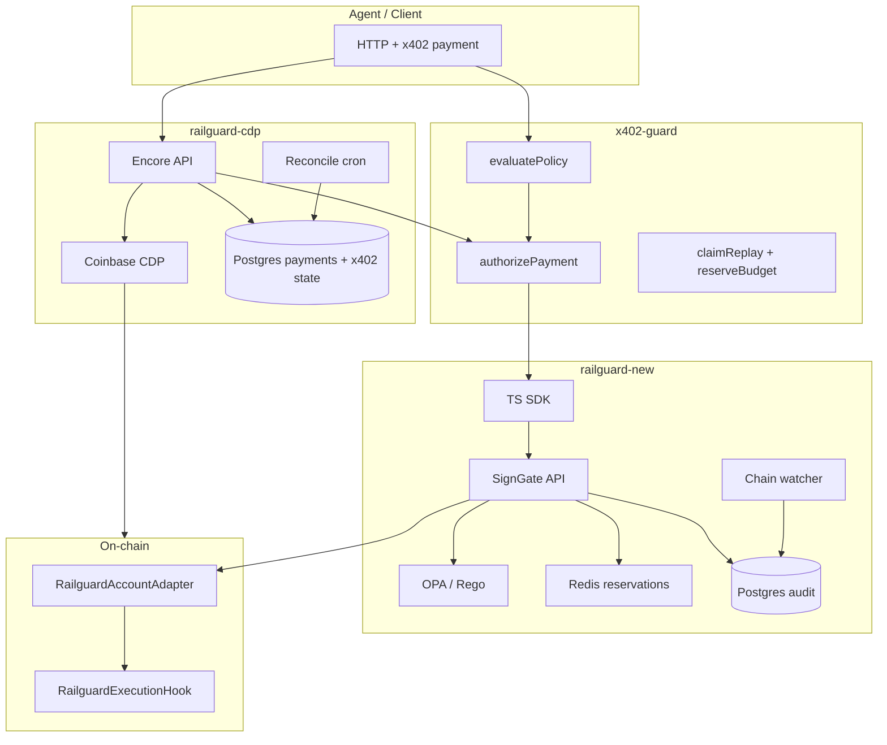

# Three-Repo Improvements & Interview Prep

**Last updated:** 2026-07-11  
**Repos:** [railguard-new](https://github.com/prasanthkuna/railguard-new) · [x402-guard](https://github.com/prasanthkuna/x402-guard) · [railguard-cdp](https://github.com/prasanthkuna/railguard-cdp) (coinbase workspace)

This document is your **spoken playbook** for interviews. It explains what we improved across all three codebases, why it mattered, and how to talk about it at staff/senior IC depth without memorizing file paths.

For day-to-day Railguard concepts (ERC-4337, hooks, session model), also read [INTERVIEW_PREP.md](./INTERVIEW_PREP.md).

---

## 1. The One-Paragraph Story

We built a **policy-enforced payment safety stack** for AI agents:

| Layer | Repo | Role |
|-------|------|------|
| Pre-sign x402 policy | `x402-guard` | Fail-closed caps, domains, replay, rolling budgets **before** payment |
| Session + on-chain enforcement | `railguard-new` | SignGate (Go), Solidity hook/adapter, OPA, watcher reconciliation |
| Invoice / CDP execution | `railguard-cdp` | Encore API, human approvals, CDP broadcast, durable x402 state in Postgres |

We ran a **three-project security audit**, found failures concentrated in **atomicity** and **truth convergence** (not naive input validation), and shipped **passes 3–5** to close critical/high findings: immutable intent hashes, atomic budget authorization, execution identity reconciliation, payment truth after broadcast, and CI/E2E proof.

**Interview line:**

> We separated *policy intelligence* from *asset safety* and then hardened the glue: every ALLOW must bind to immutable facts, every budget must reserve atomically, and every terminal payment state must converge to chain evidence.

---

## 2. System Architecture (What to Draw on a Whiteboard)



**Three enforcement boundaries to remember:**

1. **x402-guard** — off-chain, pre-payment; blocks before callback/CDP runs.
2. **SignGate + hook** — session cosign + on-chain physical ceiling (token, recipient, caps).
3. **CDP API** — exactly-once execution, approval binding, audit chain, reconciler.

---

## 3. What We Improved — By Security Pass

### Pass 3 — Durable state & first hardening

| Area | Before | After |
|------|--------|-------|
| **x402 rolling windows** | In-memory or check-then-act spend | Durable store; spend recorded with policy windows |
| **x402 callback order** | Budget could be committed before payment succeeded | Spend committed **after** successful callback |
| **x402 asset/network** | Policy fields existed but weren't enforced | `allowedAssets` / `allowedNetworks` rules in policy engine |
| **SignGate reservations** | Expired reservations could leak Redis aggregate | ZSET expiry sweep with durable member encoding |
| **SignGate budget** | Client could influence server caps | Server-side `maxTotalSpend` enforcement on reserve |
| **SignGate commit** | Loose 1:1 commit semantics | Stricter commit path on chain execution |
| **CDP x402** | Ephemeral / optional guard | Postgres-backed `x402GuardDbStore`, durable replay |
| **CDP approvals** | Approval not bound to policy facts | Approval tied to policy run / snapshot concepts |
| **CDP confirmation** | Receipt mined ≠ success | Confirmation waits for successful transfer receipt |

**Commits (representative):** `82178d9` (railguard-new), `e50d607` (x402-guard), `873f93a` (railguard-cdp)

---

### Pass 4 — Atomicity & immutable facts (re-audit response)

These closed the **critical** findings from [THREE_PROJECT_REAUDIT_2026-07-11.md](./THREE_PROJECT_REAUDIT_2026-07-11.md).

#### C-01 — Mutable intent limits behind old ALLOW (railguard-new)

| Before | After |
|--------|-------|
| Intent hash excluded `maxPerTransfer`, `maxTotalSpend`, `allowBatch` | All limits in **canonical intent hash** |
| `SaveIntent` could UPDATE limits after a decision existed | `ON CONFLICT (intent_hash) DO NOTHING` — facts are immutable |

**Talk track:** *"An attacker could get ALLOW on small caps, mutate the intent row, and cosign a larger session. We fixed it by making the hash commit to every physical field that affects enforcement."*

**Files:** `signgate/internal/intent/intent.go`, `signgate/internal/store/store.go`

---

#### C-02 — x402 budget race (x402-guard + railguard-cdp)

| Before | After |
|--------|-------|
| `sumSpendInWindow` → pay → `recordSpend` (TOCTOU) | `authorizePayment()` → `claimReplay` + `reserveBudget` → `commitAuthorization` / `releaseAuthorization` |
| Concurrent payments could exceed window cap | Atomic reservation per agent/window; authorization ID is the settlement handle |

**Talk track:** *"Budget enforcement isn't a read — it's a reservation. We introduced one primitive: authorize, commit, or release, used in middleware and Coinbase Postgres."*

**Files:** `x402-guard/packages/policy/src/authorize.ts`, `packages/policy/src/storage.ts`, `packages/middleware/src/index.ts`, `coinbase/apps/api/x402GuardDbStore.ts`

---

#### C-03 — Post-broadcast marked failed (railguard-cdp)

| Before | After |
|--------|-------|
| DB error after CDP returned tx hash → status `failed` | `broadcastedTxHash` tracked explicitly |
| Retry could double-pay | Post-broadcast errors → `submitted` / `unknown`, never `failed` |
| No worker for stuck states | `reconcileSubmittedPayments` cron every 5m |

**Talk track:** *"Once money leaves CDP, exception text is not financial truth. We split 'broadcast happened' from 'we finished bookkeeping'."*

**Files:** `coinbase/apps/api/api.ts`, `reconcile.ts`, `providers.ts`

---

#### Other pass-4 highs (summary)

| ID | Fix |
|----|-----|
| H-01 | Reservation expiry: durable ZSET member `reservationId\|sessionId\|amount`; metadata TTL 2× deadline |
| H-04 | Idempotent reserve: `GetReservationIDByIdempotency` on duplicate insert |
| H-05 | `policy_snapshot_hash` on approval; execute re-evaluates without new identity |
| H-06 | `appendAudit` in **one transaction** (advisory lock + head + insert) |
| H-07 | `waitForTransferConfirmation` requires `receipt.status === "success"` |
| H-08 | Reconciler cron for `submitted` / `unknown` |
| H-11 | Atomic `claimReplay` (Postgres + in-memory) |
| H-12 | x402 budget committed before `confirmed`; release on post-broadcast failure |

**Commits:** `feeb7ea`, `bd41d5c`, `1fe3c17`

---

### Pass 5 — Truth convergence & ops proof

| ID | Repo | Fix |
|----|------|-----|
| H-02 | railguard-new | `ExecutionAllowed` emits `executionDigest`; watcher + store reconcile **by digest**, not FIFO |
| H-03 | railguard-new | `GetSessionReserveSnapshot` — server validates agent, intent, limits, validity, `SESSION_AUTHORIZED` |
| H-09 | railguard-new | Watcher: block-by-block ingest, confirmation depth, cursor stores **block hash** |
| H-10 | railguard-new | Redis session TTL from `valid_until`; `KeepTTL` on partial release |
| P0 | railguard-cdp | CI checks out sibling `x402-guard`, builds packages, `encore check` green |
| P0 | railguard-cdp | Biome lint; file deps `../../x402-guard/...` for reproducible CI |
| P0 | railguard-new | SDK `package-lock.json` synced for Linux `npm ci` (@emnapi peer deps) |
| Docker | railguard-new | All DB migrations in compose + `apply-db-migrations.ps1`; **canonical E2E passes** |

**Commits:** `4c690d9`, `0f0c244`, `ba70a09`, `872ea83`, `3320ef0`

**Breaking deploy note:** `ExecutionAllowed` event signature changed — redeploy hook + restart watcher.

---

## 4. Per-Repo Cheat Sheet

### railguard-new (SignGate + contracts)

**What it is:** Go policy service + Solidity enforcement + TS SDK for agent session payments on ERC-4337-style nonce lanes.

**Improvements you own in interviews:**

- Immutable intent hashing with limits in canonical form
- Session register bound to consumed ALLOW decision
- Server-side reserve validation (not client-trusted caps)
- Execution digest in hook event → 1:1 watcher reconciliation
- Watcher confirmation depth + block-hash cursor
- Redis TTL aligned to session validity
- Docker E2E: deploy → cosign → reserve → on-chain execute → watcher → signed receipt
- CI: Foundry 53/53, Go tests, OPA, differential vectors, SDK on Linux

**Key commands:**

```powershell
cd signgate; go test ./...
cd contracts; forge test
powershell -File .\scripts\e2e-happy-path.ps1
powershell -File .\scripts\apply-db-migrations.ps1   # after docker compose up
```

**Files to skim before interview:**

| Topic | Path |
|-------|------|
| Intent hash | `signgate/internal/intent/intent.go` |
| Evaluate + persist | `signgate/internal/api/server.go` |
| Reserve binding | `signgate/internal/store/store.go` (`GetSessionReserveSnapshot`) |
| Hook event | `contracts/src/RailguardExecutionHook.sol` |
| Watcher | `signgate/internal/watcher/watcher.go` |
| PRD demo | `contracts/test/PrdDemo.t.sol` |
| E2E script | `scripts/e2e-happy-path.ps1` |

---

### x402-guard (npm packages)

**What it is:** Fail-closed middleware for x402 agent payments — policy, replay, rolling budgets, receipts.

**Improvements you own:**

- `authorizePayment()` as the **single atomic primitive**
- `GuardStateStore`: `claimReplay`, `reserveBudget`, `commitAuthorization`, `releaseAuthorization`
- Middleware uses authorization ID on `GuardDecision`
- Validation: amounts, domain canonicalization, asset/network rules
- 37 tests; consumed by railguard SDK and railguard-cdp

**Key commands:**

```powershell
cd x402-guard
bun test
# build individual packages if linking into coinbase:
cd packages/core && bun run build
```

**Files to skim:**

| Topic | Path |
|-------|------|
| Atomic authorize | `packages/policy/src/authorize.ts` |
| Store contract | `packages/policy/src/storage.ts` |
| Middleware flow | `packages/middleware/src/index.ts` |
| Remediation log | `docs/SECURITY_REMEDIATION.md` |

---

### railguard-cdp (Encore + Next.js)

**What it is:** Invoice payment product — vendor policy, human approval, CDP execution, audit chain.

**Improvements you own:**

- Optional x402-guard gate before CDP payment
- Postgres atomic budget + replay (`x402GuardDbStore.ts`)
- Policy snapshot hash for approval binding
- Transactional audit append
- Broadcast-aware payment state machine
- Reconcile cron for ambiguous states
- CI: lint, tests, Encore typecheck with sibling x402-guard

**Key commands:**

```powershell
cd coinbase
bun run lint
bun test apps/api packages
encore check   # needs x402-guard built at coinbase/x402-guard junction or checkout
```

**Files to skim:**

| Topic | Path |
|-------|------|
| Payment + x402 | `apps/api/api.ts`, `apps/api/x402Guard.ts` |
| DB store | `apps/api/x402GuardDbStore.ts` |
| Snapshot | `apps/api/policySnapshot.ts` |
| Reconciler | `apps/api/reconcile.ts` |
| Migration | `apps/api/migrations/007_atomic_budget_and_snapshot.up.sql` |

---

## 5. How the Three Repos Connect (Interview Answer)

> **x402-guard** runs first for agent-initiated x402 payments — it's the cheapest place to fail closed.  
> **railguard-new** is the session and on-chain enforcement plane when we're using Railguard accounts and hooks.  
> **railguard-cdp** is the product API that wires x402-guard into real CDP transfers, human approvals, and Postgres audit for B2B invoice flows.

Same **authorization primitive** (`authorizePayment` / reserve / commit / release) appears in x402-guard standalone and Coinbase Postgres — that was intentional: one mental model, two storage backends.

---

## 6. STAR Stories (Use These in Behavioral + System Design Rounds)

### Story A — "We found TOCTOU in budget enforcement"

- **Situation:** Re-audit showed concurrent x402 payments could exceed rolling windows.
- **Task:** Fix without new infrastructure (no Kafka, no new service).
- **Action:** Designed `authorizePayment` with atomic replay claim + budget reservation; wired through middleware and Postgres store; added concurrent claim test in CDP.
- **Result:** Authorization returns a durable handle; settlement commits or releases; 100-concurrent-claimer test passes on execution claim path.

### Story B — "Post-broadcast errors were lying about payment state"

- **Situation:** CDP returned a tx hash, then DB failed → status `failed` → user retries → double pay risk.
- **Task:** Make financial truth converge to chain evidence.
- **Action:** `broadcastedTxHash`, `submitted`/`unknown` terminal classes, reconciler cron, receipt status check.
- **Result:** Ambiguous states converge; retries fail closed until reconciled.

### Story C — "1:1 reconciliation was FIFO, not identity"

- **Situation:** Watcher committed oldest pending reservation per session, ignored tx/digest identity.
- **Task:** Bind chain event to reservation without scope creep to full ERC-4337.
- **Action:** Added `executionDigest` to `ExecutionAllowed` event; watcher parses new signature; store matches by digest.
- **Result:** E2E proves watcher ingests exact execution; breaking change documented for redeploy.

### Story D — "CI was green locally, red in GitHub"

- **Situation:** SDK `npm ci` failed on Linux (missing @emnapi peer entries); Coinbase couldn't resolve `@x402-guard/*`.
- **Task:** Reproducible CI from clean clone.
- **Action:** Regenerated lockfile in Node 20 container; CI checks out x402-guard sibling; docker migration script for E2E.
- **Result:** All railguard-new CI jobs pass; canonical E2E passes end-to-end.

---

## 7. Interview Question Bank (With Short Answers)

### System design

**Q: Where is the trust boundary?**  
A: On-chain hook for asset movement; x402-guard for pre-payment policy; SignGate for cosign and audit. Redis/Postgres are advisory except where we explicitly made them authoritative (x402 budget in Postgres with serializable patterns).

**Q: Why both OPA and x402-guard?**  
A: OPA is SignGate's business rules for Railguard sessions. x402-guard is transport-level agent payment policy (domains, fingerprints, rolling windows) reusable outside SignGate. CDP uses x402-guard; SignGate uses OPA.

**Q: What if SignGate is down?**  
A: No new cosigns; existing on-chain sessions still bound by hook. Production should fail closed on cosign if audit write fails.

**Q: What if Redis loses data?**  
A: Hook enforces `maxTotalSpend` on-chain; Redis prevents obvious over-booking off-chain. Postgres holds audit; watcher rebuilds chain truth.

### Security

**Q: Most dangerous bug you fixed?**  
A: Mutable intent limits behind consumed ALLOW — off-chain policy could diverge from what was approved. Immutable hash + DO NOTHING on conflict.

**Q: How do you prevent double spend in CDP?**  
A: Execution claim serialization, broadcast-aware state machine, x402 authorization commit/release, reconciler for stuck states.

**Q: What's still not production-ready?**  
A: Deep reorg rewind, HSM key custody, fault-injection integration tests at DB boundaries, full `bun audit` cleanup on CDP, production confirmation depth config. Be honest — shows maturity.

### Coding / depth

**Q: Walk through a payment happy path.**  
A: Intent evaluate → ALLOW + decisionId → session register (consumes decision) → reserve (server validates snapshot) → on-chain register+execute → hook emits `ExecutionAllowed(executionDigest)` → watcher ingests → receipt signed. For CDP: policy → approval on snapshot hash → x402 authorize → CDP broadcast → confirm → commit budget → audit append in one tx.

**Q: How does `authorizePayment` work?**  
A: Policy rules → atomic replay claim → reserve budget with authorization ID → return handle → middleware commits on callback success or releases on failure.

---

## 8. Demo Script (10-Minute Interview)

**Option A — Full proof (15 min):**

```powershell
cd railguard-new
docker compose up -d --build
powershell -File .\scripts\apply-db-migrations.ps1
powershell -File .\scripts\e2e-happy-path.ps1
```

Narrate each step: deploy, evaluate, cosign, reserve, forge script execute, watcher ingestion, receipt.

**Option B — Attack demo (5 min):**

```powershell
cd railguard-new\contracts
forge test --match-contract PrdDemo -vv
```

Shows ALLOW once + three blocked attack paths.

**Option C — x402 unit proof (3 min):**

```powershell
cd x402-guard
bun test packages/policy/src/authorize.test.ts
bun test packages/middleware/src/stateStore.test.ts
```

**Option D — CDP concurrency (2 min):**

```powershell
cd coinbase
bun test apps/api/execution-claim.test.ts
```

---

## 9. Pre-Interview Checklist (Night Before)

### Understand (don't memorize)

- [ ] Draw the 3-repo diagram from memory
- [ ] Explain C-01, C-02, C-03 and your fixes
- [ ] Recite: *Intent → Policy → Session → Signature → Hook → Receipt → Reconcile*
- [ ] Know what's **in scope v1** vs **not** (no Paymaster, no arbitrary routers, no mainnet)
- [ ] Run `e2e-happy-path.ps1` once so live demo isn't cold

### Verify green (30 min)

```powershell
# railguard-new
cd railguard-new\signgate; go test ./...
cd ..\contracts; forge test

# x402-guard
cd x402-guard; bun test

# coinbase (if discussing product API)
cd coinbase; bun run lint; bun test apps/api packages
```

### Read order (60 min)

1. This doc (overview)
2. [INTERVIEW_PREP.md](./INTERVIEW_PREP.md) §3–6, §15–16
3. [SECURITY_REVIEW.md](./SECURITY_REVIEW.md)
4. [x402-guard SECURITY_REMEDIATION.md](https://github.com/prasanthkuna/x402-guard/blob/main/docs/SECURITY_REMEDIATION.md)
5. `contracts/test/PrdDemo.t.sol` (demo narrative)

---

## 10. Repo Heads (Reference for "What Did You Ship?")

As of 2026-07-11:

| Repo | Branch | Notable head | Theme |
|------|--------|--------------|-------|
| railguard-new | `master` | `3320ef0` | Pass 5 + Docker E2E + CI lockfile |
| x402-guard | `main` | `0f0c244` | Pass 4–5 docs + `authorizePayment` |
| railguard-cdp | `main` | `ba70a09` | Pass 4–5 + CI sibling checkout |

---

## 11. Honest "Still Open" List (Say This Proactively)

Interviewers respect scope discipline. Mention these as **next hardening**, not failures:

| Item | Why it matters |
|------|----------------|
| P4 fault-injection tests | Prove reserve/commit survives crash at each boundary |
| Deep reorg rollback | Watcher has block hash; full rewind not implemented |
| HSM / MPC for SignGate keys | v1 uses dev keys; protocol boundary is proven |
| `bun audit` on CDP | Dependency graph cleanup (video workspace remnants) |
| Production confirmation depth | Configurable, >1 block for mainnet |

---

## 12. Role-Specific Angles

### Backend / Go

Focus: SignGate API, store layer, watcher, reservation Redis Lua, Postgres migrations, idempotency.

### Smart contracts

Focus: Hook preCheck/postCheck, dual-signature registration, `executionDigest` in events, `PrdDemo.t.sol`, nonce lane model.

### TypeScript / full-stack

Focus: SDK sessionId/EIP-712 vectors, x402-guard middleware, Coinbase Encore API, policy snapshot approvals.

### Security / infra

Focus: Three-project audit, TOCTOU fixes, fail-closed state machines, CI/E2E proof, threat model in [THREAT_MODEL.md](./THREAT_MODEL.md).

---

## 13. Elevator Pitches by Audience

**Product (30s):**  
Railguard lets AI agents pay vendors in stablecoin only inside pre-approved limits, with human approval for invoices and cryptographic receipts for audit.

**Engineering (30s):**  
Three layers: x402-guard before payment, SignGate + Solidity hook at execution, CDP API for real money movement — all tied together with atomic budget authorization and chain reconciliation.

**Security (30s):**  
We audited three repos, closed critical atomicity bugs (mutable intents, budget races, post-broadcast lies), and added execution identity so off-chain ledger matches on-chain events — with E2E and CI proof.

---

## 14. Related Docs

| Doc | Use when |
|-----|----------|
| [INTERVIEW_PREP.md](./INTERVIEW_PREP.md) | Core Railguard concepts, ERC-4337, hook internals |
| [THREE_PROJECT_REAUDIT_2026-07-11.md](./THREE_PROJECT_REAUDIT_2026-07-11.md) | Original findings (before fixes) |
| [THREE_PROJECT_SECURITY_AUDIT.md](./THREE_PROJECT_SECURITY_AUDIT.md) | Earlier audit context |
| [ARCHITECTURE.md](./ARCHITECTURE.md) | Layer diagram |
| [THREAT_MODEL.md](./THREAT_MODEL.md) | Attacker personas |
| [TEST_MATRIX.md](./TEST_MATRIX.md) | What each test proves |
| [HIRING_PITCH.md](./HIRING_PITCH.md) | 1-minute product pitch |

---

*You built a coherent safety story across three repos. In interviews, lead with the invariant (hook + atomic authorization + chain truth), then show the E2E demo. The remediation work is evidence you can take audit findings to shipped fixes — that's the story hiring managers want.*
