# Railguard Three-Project System Diagram

**Purpose:** One architecture view across `railguard-new`, `x402-guard`, and `railguard-cdp` — actors, enforcement layers, data stores, on-chain contracts, and security-hardened flows (passes 3–5).

**How to read:** Top = callers. Middle = three repos (color-grouped). Bottom = durable state + chain. Solid arrows = happy-path data flow. Dashed arrows = reconciliation / async / cron.

---

## Master diagram

```mermaid
flowchart TB
  %% ─── Actors ───────────────────────────────────────────────────────────
  subgraph ACTORS["Actors"]
    direction LR
    AG["🤖 AI Agent / x402 Client"]
    HU["👤 Human Approver"]
    VN["🏢 Vendor Wallet"]
  end

  %% ─── x402-guard repo ──────────────────────────────────────────────────
  subgraph X402["Repo: x402-guard · Pre-sign enforcement (fail-closed)"]
    direction TB
    subgraph X402_PKG["npm workspaces"]
      direction LR
      XC["@x402-guard/core<br/>parseResourceUrl · validatePaymentContext<br/>stableStringify · fingerprints"]
      XP["@x402-guard/policy<br/>evaluateAgentPolicy<br/>authorizePayment"]
      XM["@x402-guard/middleware<br/>X402Guard · withSpendingPolicy"]
      XR["@x402-guard/receipts<br/>ReceiptLedger · hash chain"]
    end
    subgraph X402_ATOMIC["Atomic authorization primitive"]
      direction TB
      X_R1["① claimReplay(fingerprint)"]
      X_R2["② reserveBudget(agent, amount, windows)"]
      X_R3["③ commitAuthorization / releaseAuthorization"]
      X_R1 --> X_R2 --> X_R3
    end
    XP --> X402_ATOMIC
    XM --> XP
    XM --> XR
  end

  %% ─── railguard-new repo ───────────────────────────────────────────────
  subgraph RG["Repo: railguard-new · Session policy + on-chain enforcement"]
    direction TB
    subgraph RG_SDK["TypeScript SDK"]
      SDK_I["buildIntent · canonical intent hash<br/>(limits in hash — immutable)"]
      SDK_S["sessionId · EIP-712 typed data"]
      SDK_X["createX402Guard() → middleware"]
    end
    subgraph RG_SG["Go SignGate API :8080"]
      direction TB
      SG_EV["POST /v1/intents/evaluate<br/>OPA ALLOW/BLOCK → decisionId"]
      SG_REG["POST /v1/sessions/register<br/>consumes ALLOW · Railguard cosign"]
      SG_RS["POST /v1/reservations/reserve<br/>GetSessionReserveSnapshot validation"]
      SG_UO["POST /v1/userops/* · receipts · reconciliation"]
      SG_EV --> SG_REG --> SG_RS --> SG_UO
    end
    subgraph RG_POLICY["Policy & audit"]
      OPA["OPA / Rego<br/>policy/railguard.rego"]
      RCP["EIP-712 receipt signer<br/>audit_receipts"]
    end
    subgraph RG_CONTRACTS["Solidity · Foundry"]
      direction LR
      ADP["RailguardAccountAdapter<br/>dual-sig register · session storage<br/>executeWithSession"]
      HK["RailguardExecutionHook<br/>preCheck → execute → postCheck<br/>emit ExecutionAllowed(executionDigest)"]
      VAL["RailguardSessionValidator<br/>nonce lane · session key"]
      ADP --> HK
      ADP --> VAL
    end
    subgraph RG_WATCH["Chain watcher"]
      W_IN["block-by-block ingest · confirmation depth"]
      W_ID["reconcile by executionDigest<br/>(not FIFO)"]
      W_IN --> W_ID
    end
    SDK_I --> SG_EV
    SDK_S --> SG_REG
    SDK_X --> XM
    SG_EV --> OPA
    SG_EV --> RCP
    SG_REG --> ADP
    SG_RS --> ADP
    HK -.->|events| W_IN
    W_ID --> SG_UO
  end

  %% ─── railguard-cdp repo ───────────────────────────────────────────────
  subgraph CDP["Repo: railguard-cdp · Invoice product + CDP execution"]
    direction TB
    subgraph CDP_UI["Next.js web"]
      WEB["Vendors · invoices · approvals UI"]
    end
    subgraph CDP_API["Encore API"]
      direction TB
      INV["Invoice policy evaluate<br/>escalate · duplicate detection"]
      APR["Human approval<br/>bound to policy_snapshot_hash"]
      PAY["Payment execute<br/>exactly-once claim · PAYMENT_MODE"]
      X4C["x402Guard.ts + DbGuardStateStore<br/>same authorizePayment primitive"]
      AUD["appendAudit · transactional head chain"]
      INV --> APR --> PAY
      PAY --> X4C
      PAY --> AUD
    end
    subgraph CDP_PKG["packages/"]
      direction LR
      P_POL["policy · invoice rules"]
      P_CDP["cdp · Base Sepolia USDC"]
      P_AUD["audit · stableStringify hashes"]
    end
    subgraph CDP_ASYNC["Background truth convergence"]
      CRON["reconcileSubmittedPayments<br/>cron 5m · submitted/unknown"]
      CONF["waitForTransferConfirmation<br/>receipt.status === success"]
      CRON --> CONF
    end
    WEB --> INV
    CDP_API --> P_POL
    CDP_API --> P_CDP
    CDP_API --> P_AUD
    PAY --> CRON
  end

  %% ─── Data plane ───────────────────────────────────────────────────────
  subgraph DATA["Durable state"]
    direction LR
    subgraph RG_DATA["railguard-new stores"]
      PG_RG[("Postgres<br/>intents · decisions · sessions<br/>reservations · chain_executions<br/>execution_digest · audit_receipts<br/>watcher_state + block hash")]
      RD[("Redis<br/>session budget aggregate<br/>TTL = valid_until<br/>ZSET expiry sweep")]
    end
    subgraph CDP_DATA["railguard-cdp stores"]
      PG_CD[("Postgres<br/>payment_intents · vendors<br/>x402 replay + budget<br/>audit chain · policy runs")]
    end
    subgraph X402_STORE["x402 state backends"]
      MEM["InMemoryGuardStateStore<br/>tests / dev"]
      DB_X["DbGuardStateStore<br/>production CDP path"]
    end
  end

  %% ─── Chain ────────────────────────────────────────────────────────────
  subgraph CHAIN["On-chain · Base Sepolia / Anvil"]
    direction LR
    EP["EntryPoint / bundler path<br/>(v1 prototype: direct execute)"]
    USDC["USDC transfer(address,uint256)<br/>CALLTYPE_SINGLE | BATCH"]
    ANV["Anvil :8545 · docker compose"]
    EP --> ADP
    HK --> USDC
    ANV --- EP
  end

  %% ─── External providers ─────────────────────────────────────────────────
  CDP_SDK["Coinbase CDP SDK<br/>broadcast · demo mode guard"]

  %% ─── Actor entry points ─────────────────────────────────────────────────
  AG -->|"x402 HTTP + payment header"| XM
  AG -->|"Railguard session path"| SDK_I
  HU --> WEB
  VN -.->|"receives USDC"| USDC

  %% ─── Cross-repo wiring ──────────────────────────────────────────────────
  X402_ATOMIC --> MEM
  X402_ATOMIC --> DB_X
  X4C --> XP
  X4C --> DB_X
  DB_X --> PG_CD

  SG_EV --> PG_RG
  SG_REG --> PG_RG
  SG_RS --> RD
  SG_RS --> PG_RG
  SG_UO --> PG_RG
  W_ID --> PG_RG
  RCP --> PG_RG

  PAY --> CDP_SDK
  CDP_SDK --> CHAIN
  SG_REG --> CHAIN
  SG_UO --> CHAIN

  APR --> PG_CD
  PAY --> PG_CD
  AUD --> PG_CD
  CRON --> PG_CD

  %% ─── Enforcement boundary annotations ─────────────────────────────────
  classDef boundary fill:#1a1a2e,stroke:#e94560,stroke-width:3px,color:#fff
  classDef store fill:#0f3460,stroke:#53d8fb,stroke-width:2px,color:#fff
  classDef chain fill:#16213e,stroke:#f4a261,stroke-width:2px,color:#fff
  classDef atomic fill:#2d6a4f,stroke:#95d5b2,stroke-width:2px,color:#fff

  class X402,XP,XM boundary
  class HK,ADP boundary
  class PAY,X4C boundary
  class PG_RG,RD,PG_CD store
  class CHAIN,USDC chain
  class X402_ATOMIC,X_R1,X_R2,X_R3 atomic
```



---

## Flow legends (same diagram)

### Path A — Agent x402 payment (middleware)

```text
Agent → X402Guard.evaluate → authorizePayment (replay + budget reserve)
     → callback / CDP or downstream pay → commitAuthorization | releaseAuthorization
```

### Path B — Railguard session payment (canonical E2E)

```text
Agent → SDK intent (immutable hash) → SignGate evaluate (OPA ALLOW + decisionId)
     → session register (consumes decision, Railguard EIP-712 cosign)
     → reserve (server-side snapshot: agent, intent, limits, validity)
     → Adapter.register + executeWithSession → Hook.preCheck/postCheck
     → ExecutionAllowed(executionDigest) → Watcher (by digest) → Postgres
     → signed receipt
```

### Path C — B2B invoice via railguard-cdp

```text
Web → invoice policy → human approval (policy_snapshot_hash)
    → x402 authorizePayment (Postgres store) → CDP broadcast
    → broadcastedTxHash tracked → confirm (receipt.status=success)
    → budget commit · audit append (single tx) · reconciler for unknown/submitted
```

---

## Trust boundaries (annotate when presenting)

| # | Boundary | Guarantees | Does not guarantee |
|---|----------|------------|-------------------|
| 1 | **x402-guard** | Blocks before spend; atomic replay + rolling budget | On-chain asset movement |
| 2 | **SignGate + OPA** | Business policy; cosign only consumed ALLOW; immutable intent | Chain finality |
| 3 | **Redis reservations** | Off-chain over-booking prevention; TTL tied to session | Caps beyond hook (advisory) |
| 4 | **Execution hook** | Token, recipient, selector, per-tx cap, total spend, batch rules | Sanctions / KYC |
| 5 | **Watcher** | Chain events → DB by `executionDigest` | Deep reorg rewind (v1) |
| 6 | **CDP API** | Exactly-once execute; approval binding; audit chain integrity | Chain liveness |

---

## Repositories & deploy units

| Repo | Primary artifacts | Runtime |
|------|-------------------|---------|
| `x402-guard` | 4 npm packages | Library (SDK / Encore import) |
| `railguard-new` | SignGate binary, contracts, SDK | Docker: postgres, redis, anvil, signgate |
| `railguard-cdp` | Encore API, Next.js web | Encore cloud + Vercel (web) |

---

## Key hardened identifiers (pass 4–5)

```text
intentHash          = canonical payment facts incl. limits (immutable)
decisionId          = consumable ALLOW/BLOCK record
sessionId           = keccak(chainId, adapter, account, nonceKey, physicalConfig)
authorizationId     = x402 budget reservation handle (auth_<uuid>)
executionDigest     = on-chain event identity for 1:1 reconciliation
policy_snapshot_hash = CDP approval binding
broadcastedTxHash   = financial truth after CDP returns hash
```

---

## Local proof commands

```powershell
# Full cross-stack E2E (railguard-new)
cd railguard-new
docker compose up -d --build
powershell -File .\scripts\apply-db-migrations.ps1
powershell -File .\scripts\e2e-happy-path.ps1

# x402 atomic primitive
cd x402-guard && bun test

# CDP execution claim + policy
cd coinbase && bun test apps/api packages
```

---

## Related docs

- [ARCHITECTURE.md](./ARCHITECTURE.md) — layer definitions  
- [FAILURE_MODES_FIXED.md](./FAILURE_MODES_FIXED.md) — audit findings → fixes → proof  
- [THREAT_MODEL.md](./THREAT_MODEL.md) — threats + production key custody path  
